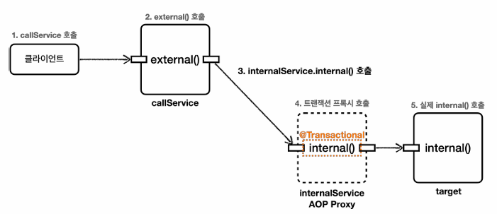
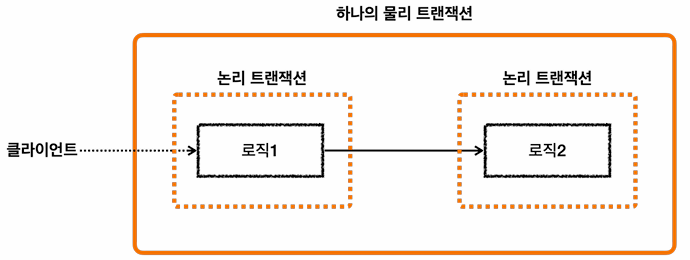
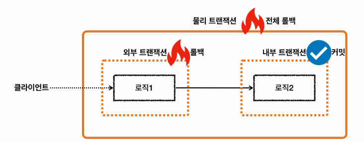
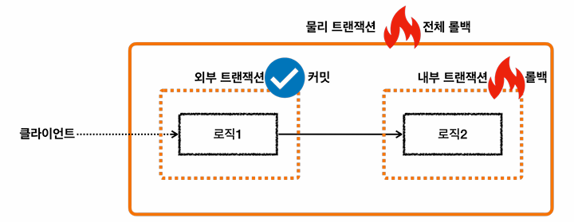
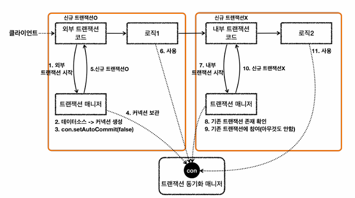
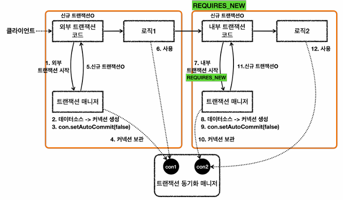

# 🔎 Transaction
## 📝 Study
* 트랜잭션
    * 로그를 사용해 트랜잭션 적용 확인
    * 트랜잭션 위치에 따른 우선순위
    * 트랜잭션 AOP 사용시 주의사항
    * 다양한 트랜잭션 옵션
    * 예외에 따른 트랜잭션 커밋, 롤백
* 트랜잭션 전파
    * REQUIRES / REQUIRES_NEW
    * 트랜잭션 전파 활용

## 트랜잭션(Transaction)
> 앞 강의에서 트랜잭션 기능과 내부 동작 구조에 대해 알아보았다. 트랜잭션을 조금 더 깊이 알아보기 위해 이전 내용을 잠시 복습하자.

### 스프링 트랜잭션 추상화
JDBC 기술, JPA 기술 등 각각의 데이터 접근 기술은 트랜잭션을 사용하는 코드 자체가 다르다.

* JDBC 트랜잭션

```java
public void accountTransfer(String fromId, String toId, int money) throws SQLException {
Connection con = dataSource.getConnection();
try {
con.setAutoCommit(false); //트랜잭션 시작

        bizLogic(con, fromId, toId, money); //비즈니스 로직

        con.commit(); //성공시 커밋
    } catch (Exception e) {
        con.rollback(); //실패시 롤백
        throw new IllegalStateException(e);
    } finally {
        release(con);
    }
}
```
* JPA 트랜잭션
```java
public static void main(String[] args) {
    //엔티티 매니저 팩토리 생성
    EntityManagerFactory emf = Persistence.createEntityManagerFactory("jpabook");
    EntityManager em = emf.createEntityManager(); //엔티티 매니저 생성
    EntityTransaction tx = em.getTransaction(); //트랜잭션 기능 획득
    try {
        tx.begin(); //트랜잭션 시작

        logic(em);  //비즈니스 로직

        tx.commit(); //트랜잭션 커밋
    } catch (Exception e) {
        tx.rollback(); //트랜잭션 롤백
    } finally {
        em.close(); //엔티티 매니저 종료
    }
    emf.close(); //엔티티 매니저 팩토리 종료
}
```
*따라서 jdbc 기술을 쓰다가 jpa 기술로 변경하게 되면 트랜잭션을 사용하는 코드 모두 변경 해야한다.*

스프링은 이런 문제를 해결하기 위해 **스프링 트랜잭션 추상화**를 제공한다.

**PlatformTransactionManager**   
스프링 트랜잭션 추상화를 사용하는 방법은 2가지가 있다.
1. 선언적 트랜잭션
```java
@Transactional
org.springframework.transaction.annotation.Transactional
```
* 애노테이션을 클래스나 메서드 단위에 선언하여 관리하는 트랜잭션
* 선언적 트랜잭션을 사용하면 기본적으로 **프록시 방식의 AOP**가 적용된다.   

*위 그림만 잘 이해해도 트랜잭션 AOP에 대해 어느정도는 이해했다고 생각해도된다!*

2. 프로그래밍 방식의 트랜잭션
- 트랜잭션 매니저 또는 트랜잭션 템플릿 등을 사용해서 트랜잭션 관련 코드를 직접 작성하여 관리하는 트랜잭션
## 트랜잭션 적용 확인
```
logging.level.org.springframework.transaction.interceptor=TRACE

application.properties에 추가하면 트랜잭션 프록시가 호출하는 트랜잭션의 시작과 종료를 명확하게 로그로 확인할 수 있다.
```
> @Transactional을 통해 선언적 트랜잭션 방식을 사용하면 단순히 애노테이션을 선언만 해도 트랜잭션을 적용할 수 있다. 하지만, 트랜잭션 관련 코드가 눈에 보이지 않고, AOP를 기반으로 동작하기 때문에, 실제 트랜잭션이 적용되고 있는지 아닌지 확인하기가 어렵다.
### AopUtils.isAopProxy()
선언적 트랜잭션 방식에서 스프링 트랜잭션은 AOP를 기반으로 동작하기 때문에 위 메서드를 실행시켰을 때 ture가 되고, getClass()로 클래스명을 로그에 남겼을 때
```
$BasicService$$EnhancerBySpringCGLIB$
```
프록시 클래스 이름이 출력된다.
###  TransactionSynchronizationManager.isActualTransactionActive()
현재 쓰레드에 트랜잭션이 적용되어 있는지 확인할 수 있는 기능
## 트랜잭션 적용 위치에 따른 우선순위
> @Transactional의 적용 위치에 따라 우선순위가 달라진다. 스프링은 **더 구체적이고 자세한 것이 높은 우선순위를 가진다**
1. 클래스 메서드(우선순위가 가장 높다)
2. 클래스의 타입
3. 인터페이스의 메서드
4. 인터페이스의 타입(우선순위가 가장 낮다)
## 트랜잭션 AOP 주의사항
### 내부 호출

internal() - 트랜잭션 적용   
external() - 트랜잭션 미적용
* 스프링 트랜잭션은 한 클래스에 하나라도 @Transactional이 있다면 프록시를 생성한다.
* 트랜잭션이 적용되지 않은 external()은 AOP 프록시가 생성되지만 트랜잭션 적용 없이(아무 작동 없이) 그대로 target external()을 호출하여 로직을 실행한다.
* 이 때, target external() 내에서 트랜잭션이 적용된 internal()을 호출하면?
* 프록시 객체에서 internal()을 호출하는게 아니기 때문에 **트랜잭션이 적용되지 않는다!!**

해결 방안으로 internal() 메서드를 따로 클래스로 빼서(InternalService 생성) 트랜잭션을 적용시키고 external() 메서드 내에서는 내부에서 호출하는게 아닌 외부의 InternalService 클래스 내의 internal() 메서드를 호출하는 방법을 사용

>*실무에서 자주 발생되는 문제점 중 하나이기 때문에 충분히 숙지해두자!*
### 초기화 시점
```
@PostContruct
- Spring이 초기화 될 때 호출하지 않아도 실행되게 할 수 있는 애노테이션
- 하지만, 여기에 @Transactional을 선언하게 되면 트랜잭션이 적용되지 않는다.
- 왜냐하면 초기화 코드가 먼저 호출되고, 다음 트랜잭션 AOP가 적용되기 때문에 AOP 프록시 객체를 생성하여 트랜잭션을 적용하는 @Transactional은 적용되지 않는것
```
```
@EventListener(value = ApplicationReadyEvent.class)
- PostContruct 대신 ApplicationReadyEvent를 사용하면 스프링 초기화 메서드 내에도 트랜잭션을 적용할 수 있다.
- 이 애노테이션은 트랜잭션 AOP를 포함한 스프링 컨테이너가 완전히 생성되고 난 다음 호출되기 때문이다.
```
## 트랜잭션 옵션
### value, transactionManager

```java
public class TxService {
    @Transactional("memberTxManager")
    public void member() {...}
    
    @Transactional("orderTxManager")
    public void order() {...}
 }
```
* 
* 트랜잭션을 사용하려면 스프링 빈에 등록된 어떤 트랜잭션 매니저를 사용할지 알아야함 원하는 매니저를 value, transactionManager 속성값을 넣어줘야함(value는 생략 가능)
### rollbackFor

```java
@Transactional(roobackFor = Exception.class)
```
* 예외 발생시 스프링 트랜잭션의 기본 정책은 언체크 예외는 롤백, 체크 예외는 커밋한다.
* 이 속성값을 지정하게되면 체크 예외라도 설정한 예외는 **롤백**한다.
### noRollbackFor
* rollbackFor의 반대
### propagation
* 트랜잭션 전파
### isolation
* 트랜잭션 격리 수준 지정
    * DEFAULT(기본값) : 데이터베이스에서 설정한 격리 수준을 따른다
    * READ_UNCOMMITTED : 커밋되지 않은 읽기
    * READ_COMMITTED : 커밋된 읽기
    * REPEATABLE_READ : 반복 가능한 읽기
    * SERIALIZABLE : 직렬화 가능
### timeout
* 트랜잭션 수행 시간에 대한 타임아웃을 초 단위로 지정
* 운영환경에 따라 동작하는 경우가 있고 그렇지 않은 경우가 있기 때문에 확인하고 사용
### readOnly
* 트랜잭션은 기본적으로 **읽기 쓰기가 모두 가능한** 트랜잭션이 생성된다.

```
readOnly=true
읽기 전용 트랜잭션 생성
(등록,수정,삭제가 안되고 읽기만 가능)
```

## 예외와 트랜잭션 커밋, 롤백

```
logging.level.org.springframework.jdbc.datasource.DataSourceTransactionManager=DEBUG
#JPA log
logging.level.org.springframework.orm.jpa.JpaTransactionManager=DEBUG
logging.level.org.hibernate.resource.transaction=DEBUG

application.properties에 추가하면 트랜잭션이 커밋되었는지 롤백 되었는지 로그로 확인 가능
```

앞서 말했듯이 스프링은 체크 예외는 커밋하고, 언체크 예외는 롤백한다. 왜그럴까?

* 체크 예외 : 비즈니스 의미가 있을 때 사용
* 언체크 예외 : 복구 불가능한 시스템 예외

스프링은 위와 같이 판단하게 되어있다.

```
#JPA SQL
logging.level.org.hibernate.SQL=DEBUG

application.properties에 추가하면 JPA(하이버네이트)가 실행하는 SQL을 로그로 확인 가능
```

예를 들어, 고객이 결제를 하는데 잔고 부족으로 체크 예외인 NotEnoughMoneyException이 발생되었다.   
이는 시스템적 복구 불가 예외가 아니고 고객의 문제로 발생되는 비즈니스적 에러이다.   
그럼 에러에 메시지를 담아 잔액 부족으로 결제가 안되었으며, 해결방안을 고객에게 안내할 수 있다.   
이렇게 에러를 return 값처럼 사용하고, 결제만 진행을 못 했지 주문은 한 것이기 때문에 commit을 하면 주문 자체는 사라지지 않고, 결제만 해결방법을 에러로 남겨줄 수 있다.   
만약, 아예 롤백을 하고 싶다면 앞서 설명한 옵션 값 중 rollbackFor를 사용하자.
## 트랜잭션 전파

> 앞서 학습한 내용처럼 트랜잭션이 각각 작동하여 커밋, 롤백되고 커넥션이 반환되면 문제가 없다. 그런데 A트랜잭션이 진행 중인인데 B트랜잭션이 또 작동을하게되면 커밋과 롤백은 어떻게 작동할까?
### 트랜잭션 전파 REQUIRED

* 스프링의 경우 외부트랜잭션과 내부트랜잭션을 묶어서 하나의 물리 트랜잭션으로 만들어주고, 내부트랜잭션이 외부트랜잭션에 **참여**하게된다. 또, 외부트랜잭션이 물리트랜잭션을 제어하게된다.   
  (물론, 옵션을 통해 다른 방법으로 처리할 수도있다.)
```
대원칙!
1. 모든 논리 트랜잭션이 **커밋**되어야 물리트랜잭션이 **커밋**된다.
2. 하나의 논리 트랜잭션이라도 **롤백**되면 물리 트랜잭션은 **롤백**된다.
```




> 외부 트랜잭션
1. 외부 트랜잭션이 시작되면 트랜잭션 매니저는 데이터소스를 통해 커넥션을 생성한다.
2. 생성한 커넥션을 수동 커밋 모드로 설정한다. -> 물리 트랜잭션 시작
3. 트랜잭션 매니저는 **트랜잭션 동기화 매니저**에 커넥션을 보관한다.
4. 트랜잭션 매니저는 트랜잭션을 생성한 결과를 TransactionStatus에 담아서 반환하는데 여기에 **신규 트랜잭션의 여부**가 담겨있다
5. 외부트랜잭션이 처음 시작했으므로 신규 트랜잭션이다.(isNewTransaction=true)
6. 로직1이 시작되고 커넥션이 필요한 경우 트랜잭션 동기화 매니저를 통해 트랜잭션이 적용된 커넥션을 획득해서 사용한다.
> 내부 트랜잭션
1. 내부 트랜잭션을 시작한다.
2. 트랜잭션 매니저는 트랜잭션 동기화 매니저를 통해 **기존 트랜잭션이 존재하는지 확인**한다.
3. 기존 트랜잭션이 존재하므로 **기존 트랜잭션에 참여**한다. -> 아무것도 하지 않는 다는것(커밋,롤백)
4. 이미 기존 트랜잭션(외부 트랜잭션)에 참하는 트랜잭션이기 때문에 isNewTransaction은 false이다.
5. 로직2가 사용되고, 커넥션이 필요한 경우 트랜잭션 동기화 매니저를 통해 외부 트랜잭션이 보관한 커넥션을 획득하여 사용한다.

```
내부 트랜잭션에서 롤백이 발생되면?   
내부 트랜잭션 종료 시 rollbackOnly=true라는 표시를 하게된다.   
외부 트랜잭션이 다시 시작하게 될 때 물리 트랜잭션에게 커밋을 요청해도 rollbackOnly=true라고 마크되어있는 것을 확인하고 UnexpectedRollbackException 예외를 발생시킨다.
```
### 트랜잭션 전파 REQUIRED_NEW

* REQUIRED_NEW 옵션을 넣게되면 내부 트랜잭션으로 참여하는 것이 아닌 새로운 트랜잭션을 생성한다.
* 새로운 트랜잭션이기 때문에 isNewTransaction도 true이고, 롤백되어도 외부 트랜잭션에 영향을 주지 않는다.
* 새로 트랜잭션이 시작될 때 외부 트랜잭션의 커넥션이 잠시 보류되고 수행되기 때문에 데이터베이스 커넥션을 2배로 쓰게된다. -> 추후 운영 시 이 부분을 염두해두고 해당 옵션을 사용해야한다.(요청은 500개인데 커넥션은 1000개를 쓰게되는 경우 발생)